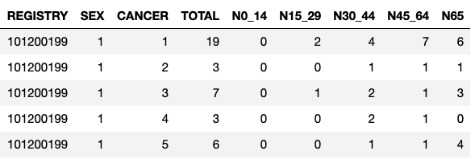
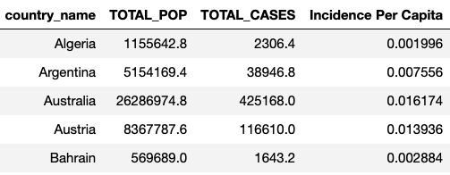
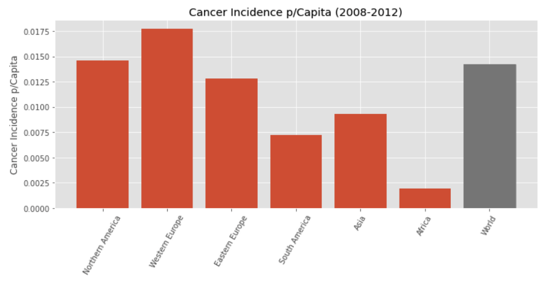
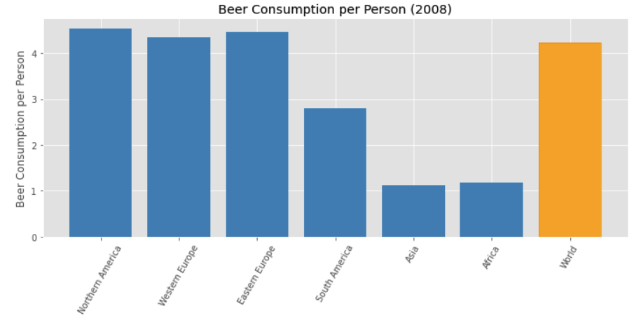
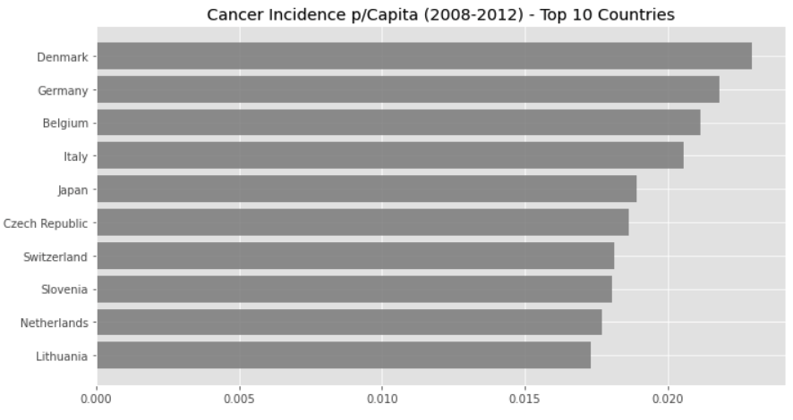
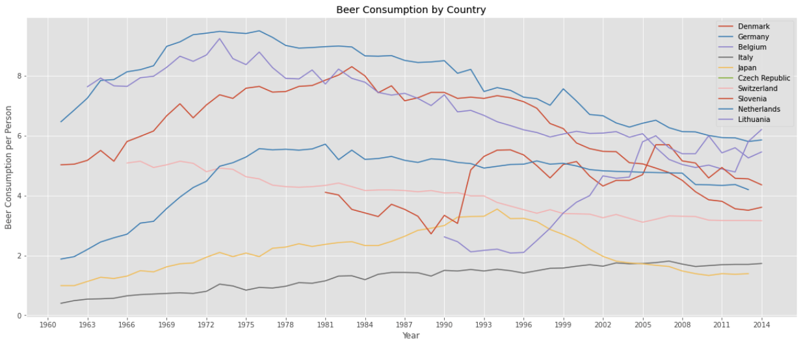
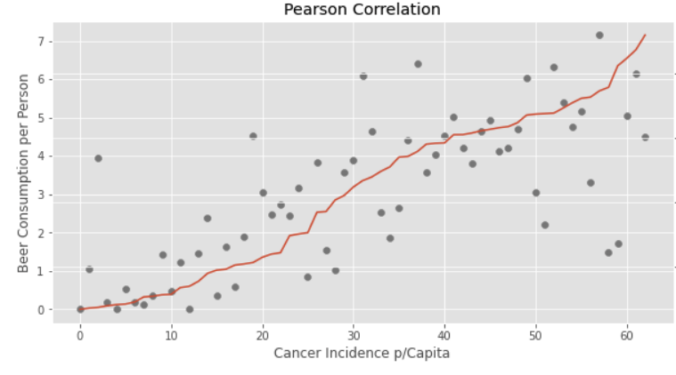
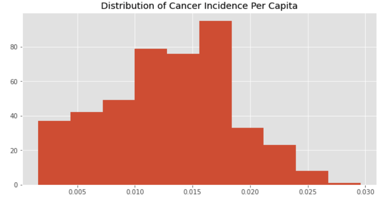

# Beer Consumption vs. Cancer Correlation
Does beer consumption affect cancer incidence rate?

## Project Description
Cancer is a disease of genetic mutation and also that environment can play a huge role, e.g. food consumption, life habits, etc. In this project, I would like to understand if there is a correlation between beer consumption and cancer incidence rate. Will a person who drinks beer more than average have a higher chance of getting cancer? I will analyze global cancer data by country compared with beer consumption to see if we can find correlation that might support the claim.

## Data Description
1. The CI5 database from the World Health Organization contains incidence rates from 443 cancer registries in 65 countries for cancers diagnosed from 2008 to 2012, for all cancers and 28 major types. There is one with population metrics, and one for the cancer cases reported. Population data includes columns for Registry (reporting location), Year, Sex, Total population, and remaining columns are the breakdowns by age range (every 5 years). The Case files include columns to indicate the Registry, Year, Sex, Cancer type code, and the same 5 year age range counts.
2. The Our World in Data site provides a chart and downloadable .csv of the beer consumption per person data from 189 countries from 1960 to 2015. It contains average annual per capita beer consumption which measured in liters of pure alcohol. Beer contains around 5% of pure alcohol per volume so that one liter of beer contains 0.05 liters of pure alcohol. This means that 5 liters of pure alcohol equals 100 liters of beer.

## Prepare the Data
1. Cancer statistics are reported reginally by "registry". The "registry" contains combination of areas, race, states and time frame which were seperated by coma, semicolon and asterisk. The data set was cleaned to only include national level data with standerdized format.
2. The cancer data set is aggregated from 2008-2012, so the cases of cancer was divided by 5 for an annual average for this time period.
3. Beer consumption per person was aggregated by country for 2008.
4. Weighted averages were used for the cancer incidence rate by population sample size.

### Sample Data


### After transformation


## Assumptions/Caveats
1. Some countries do not tend to report cancer statistics as thoroughly as other countries. Countries without screening may detect cancer later.
2. Only 63 countries were compared in this analysis where adequate data existed for both cancer statistics and beer consumption.
3. Assume each incidence of cancer is independent of the others.

## Insights

### World Cancer Incidence Rate

Western Europe has the highest cancer incidence rate, followed by Northern America and Eastern Europe based on the cancer statistics from WHO. A caveat is that the result could be biased as some countries do not tend to report cancer statistics as thoroughly as other countries.

### World Beer Consumption

Northern America, Eastern Europe and Western Europe have higher beer consumption than rest of the world. Looks like there could be a correlation between cancer and beer consumption.

### Top 10 countries with the highest cancer incidence rate from 2008-2012

Denmark has the highest cancer incidence rate (0.02 - 0.025). Top 10 countries are mostly European countries. 

### Beer Consumption per Person for the Top 10 countries



## Is there a correlation?

### Pearson Correlation
Pearson correlation coefficient is a measure of linear correlation between two sets of data. A value of 1 implies that a linear equation describes the relationship between X and Y perfectly with all data points lying on the line for which Y increases as X increases. A value of -1 implies that all data points lie on a line for which Y decreases as X increases. A value of 0 implies that there is no linear correlation between the variables. 

The pearson correlation coefficient is 0.72 based on the code below
```
df_stats[['country_name','Incidence Per Capita','Consumption']].corr(method = 'pearson')
```


Looks like there is a strong correlation between cancer statistics and beer consumption, as beer consumption increases, the probability of getting cancer also increases. Let's test that.

### Hypothesis Testing
We would like to test if people who drink beer more than average have a higher cancer incidence rate.

We use 5% significance level in this test. 
Our null hypothesis is that there is no difference in cancer incidence rate between people who drinks beer more than average and people who drinks beer less than aveverage.
The alternative hypothesis is that there is a difference in cancer incidence rate between people who drinks beer more than average and people who drinks beer less than aveverage.

P1 = P(cancer incidence rate for people who drinks beer less than average)

P2 = P(cancer incidence rate for people who drinks beer more than average)

H0: P1 = P2

H1: P1 != P2

Assuming that each cancer incidence is independent of all the rest, it approximately follows a binomial distribution. 



Our sample population are: Population who drink beer more than world average; Population who drink beer less than world average.

Based on z-test, the p-value is 3.476899628595322e-06, significantly less than the significance level (5%).


## Conclusions
Based on this analysis, our p-value is far below the significance level (5%), I therefore reject the null hypothesis and conclude that beer consumption has correlation with cancer incidence. Due to the many assumptions required for this type of statistical analysis to be accurate, many of which do not hold true, this should not be considered conclusive evidence, but perhaps may prompt additional study.
